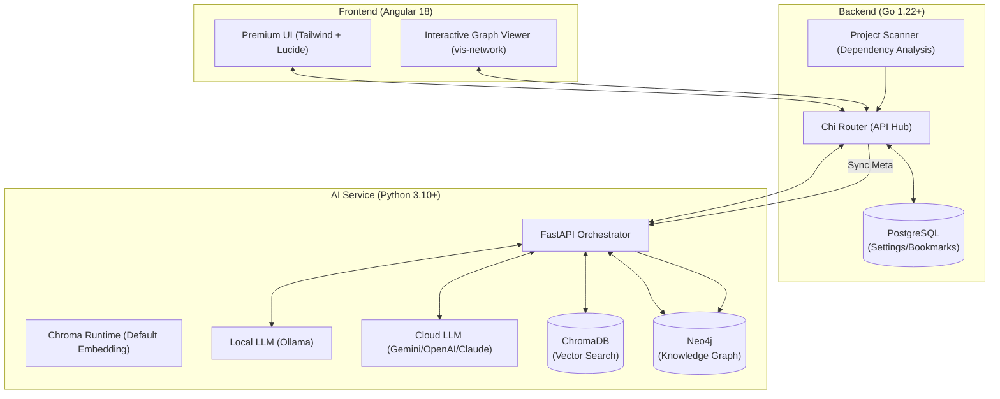

# AI-CodeWiki ⚡

AI-CodeWiki is a powerful, AI-driven codebase intelligence tool designed to help developers understand, navigate, and analyze complex codebases in minutes. By combining semantic search (RAG), **interactive graph-based dependency analysis**, and multi-model LLM support, it provides a comprehensive overview of any project.

## 🏗️ High-Level Architecture



---

## 🌟 Key Features

- **🚀 Interactive Knowledge Graph**: Visualize your project's architecture with a high-performance, interactive graph powered by **Neo4j** and **vis-network**. Drag, zoom, and explore file relationships in real-time.
- **🧠 Multi-Model AI Engine**: Seamlessly switch between local models (**Ollama**) and premium cloud providers (**Gemini 3 Pro, OpenAI GPT-4o, Claude 4.6 Sonnet**) via a premium settings overlay.
- **🔍 Semantic Search (RAG)**: Find code by concept, not just keywords. Powered by **ChromaDB** and semantic embeddings.
- **🛡️ Impact Analysis**: Understand the blast radius of your changes before you commit. AI analyzes your Knowledge Graph to predict side effects.
- **✨ Instant Summaries**: Get AI-generated summaries with smooth animations, explaining the purpose and logic of any file at a glance.
- **💎 Premium UI/UX**: Modern glassmorphism interface with dark mode, smooth transitions, and a developer-first experience.

---

## 🚀 Getting Started

### Prerequisites

| Tool | Version | Used For |
|------|---------|----------|
| Go | >= 1.21 | Backend |
| Node.js | >= 20 | Frontend |
| Python | >= 3.11 | AI Brain |
| Docker | any | Full stack (optional) |

---

## Option A — Local Dev (Hot Reload)

รัน 3 terminal แยกกัน:

### Terminal 1: Backend (Go)

```bash
cd backend
go run ./cmd/server
# ✅ http://localhost:8080
```

### Terminal 2: AI Brain (Python)

```bash
cd ai-service
pip install -r requirements.txt
uvicorn main:app --reload
# ✅ http://localhost:8000
```

> ถ้าใช้ **Gemini / OpenAI** แทน Ollama สามารถข้ามขั้นตอนนี้ได้
> แล้วไปตั้งค่า API Key ใน Settings ของแอปแทน

### Terminal 3: Frontend (Angular)

```bash
cd frontend
npm install        # ครั้งแรกเท่านั้น
npm start          # = ng serve
# ✅ http://localhost:4200
```

---

## Option B — Docker Compose (ทุก service พร้อมกัน)

### 1. แก้ไข path ใน docker-compose.yml

```yaml
# Windows (backend → volumes)
- D:/work:/projects:ro      # ← เปลี่ยนให้ตรงกับ folder ที่มีโปรเจค

# macOS/Linux
- /Users/yourname:/projects:ro
```

### 2. รัน

```bash
docker compose up --build
```

| URL | Service |
|-----|---------|
| http://localhost | Frontend |
| http://localhost:8080 | Backend API |
| http://localhost:8000 | AI Brain |
| http://localhost:7474 | Neo4j Browser (neo4j / password) |

```bash
# หยุด
docker compose down
```

---

## 🛠️ การตั้งค่าหลังรัน

1. เปิด http://localhost:4200
2. คลิก **Open Project** → เลือก folder โปรเจค
3. ไปที่ **Settings** (⚙️) → ใส่ API Key หรือเลือก Ollama
4. คลิกไฟล์ใน File Tree → รับ AI Summary + Dependency Graph

### Environment Variables

| Variable | Default | Description |
|----------|---------|-------------|
| `PORT` | `8080` | Backend port |
| `DATABASE_PATH` | `./data/codewiki.db` | SQLite path |
| `AI_SERVICE_URL` | `http://localhost:8000` | AI Brain URL |
| `OLLAMA_BASE_URL` | `http://localhost:11434` | Ollama endpoint |
| `OLLAMA_MODEL_CODE` | `qwen2.5-coder:7b` | Model for code |

---

## 🔒 License
MIT License. See `LICENSE` for details.

