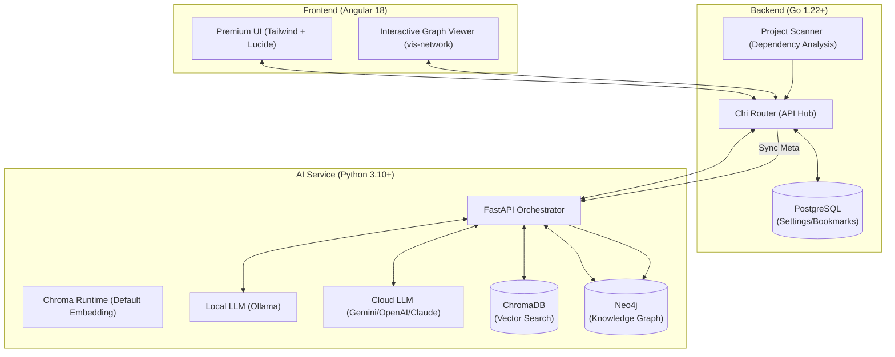

# AI-CodeWiki ⚡

AI-CodeWiki is a powerful, AI-driven codebase intelligence tool designed to help developers understand, navigate, and analyze complex codebases in minutes. By combining semantic search (RAG), **interactive graph-based dependency analysis**, and multi-model LLM support, it provides a comprehensive overview of any project.

## 🏗️ High-Level Architecture



---

## 🌟 Key Features

- **🚀 Interactive Knowledge Graph**: Visualize your project's architecture with a high-performance, interactive graph powered by **Neo4j** and **vis-network**. Drag, zoom, and explore file relationships in real-time.
- **🧠 Multi-Model AI Engine**: Seamlessly switch between local models (**Ollama**) and premium cloud providers (**Gemini 3 Pro, OpenAI GPT-4o, Claude 4.6 Sonnet**) via a premium settings overlay.
- **🔍 Semantic Search (RAG)**: Find code by concept, not just keywords. Powered by **ChromaDB** and semantic embeddings.
- **🛡️ Impact Analysis**: Understand the blast radius of your changes before you commit. AI analyzes your Knowledge Graph to predict side effects.
- **✨ Instant Summaries**: Get AI-generated summaries with smooth animations, explaining the purpose and logic of any file at a glance.
- **💎 Premium UI/UX**: Modern glassmorphism interface with dark mode, smooth transitions, and a developer-first experience.

---

## 🚀 Getting Started

### 1. Prerequisites
- **Docker & Docker Compose** (Recommended)
- **Ollama** (Running on host machine)
- Node.js 20+, Go 1.22+, Python 3.10+ (For manual dev setup)

### 2. Running with Docker (Quick Start)
The easiest way to get the full stack (Go, Python, Postgres, Neo4j, Chroma) is via Docker Compose:

```bash
docker-compose up --build
```

- **Frontend**: `http://localhost`
- **Backend API**: `http://localhost:8080`
- **Neo4j Console**: `http://localhost:7474` (User: `neo4j`, Password: `password`)

---

## 🛠️ Configuration
You can configure providers and models directly in the **Settings Modal** within the app. 
- **Local:** Ollama (requires local installation)
- **Cloud:** Requires an API Key from Google, OpenAI, or Anthropic.

---

## 🔒 License
MIT License. See `LICENSE` for details.
