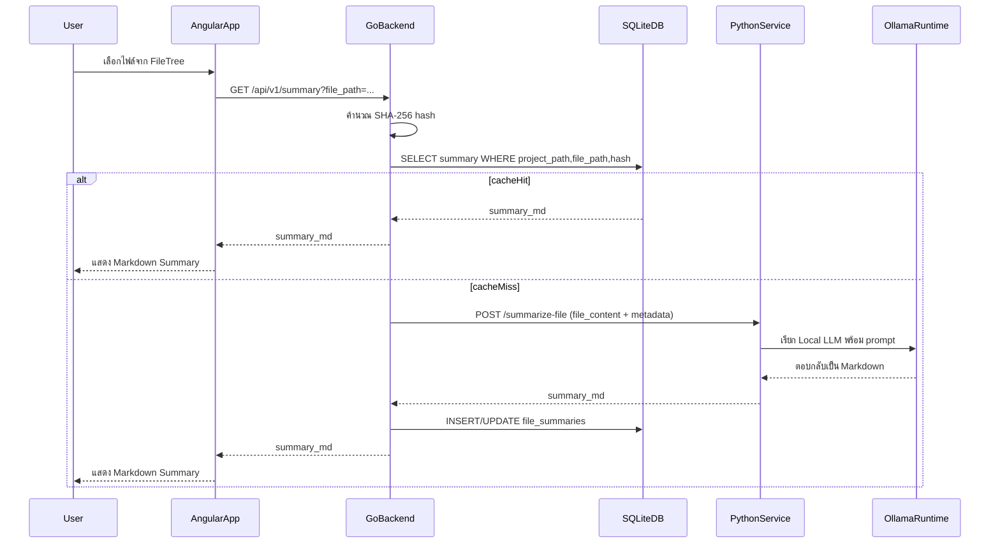
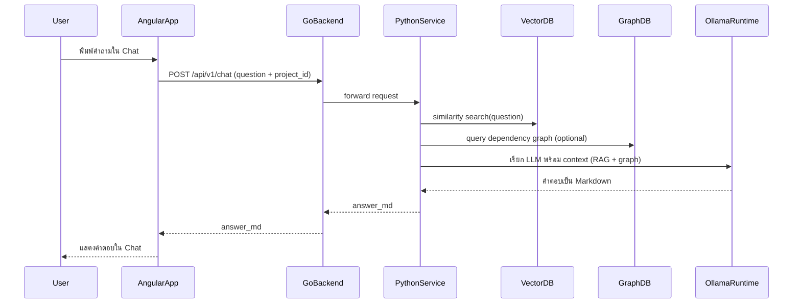

# System Specification & AI Plan: AI-Powered Code Wiki

## 1. Project Overview
แอปพลิเคชันสำหรับนักพัฒนา เพื่อใช้อ่านและทำความเข้าใจโครงสร้างโปรเจกต์ (Source Code) ในเครื่อง Local หรือบน VM ทำงานเสมือน IDE (เช่น VS Code) โดยนำ **Local LLM** มาช่วยสรุปการทำงานของไฟล์ วิเคราะห์ผลกระทบข้ามไฟล์ (RAG + Knowledge Graph) และมีระบบ Caching เพื่อความรวดเร็วและประหยัดทรัพยากร

ระบบนี้ออกแบบมาสำหรับ **offline / local-first** เป็นหลัก โดย AI ทั้งหมดรันบนเครื่องผ่าน Ollama เพื่อให้ควบคุมค่าใช้จ่าย ความเป็นส่วนตัว และ latency ได้ดี

## 2. System Architecture (The Tri-Force Architecture)
ระบบแบ่งออกเป็น 3 ส่วนหลัก ทำงานประสานกัน:

1. **Frontend (UI) – The Face:** `Angular` (SPA, No SSR) แสดงผล File Tree, Markdown Renderer, Chat Interface และจัดการ State ของผู้ใช้
2. **Backend Agent (The Muscle):** `Go (Chi Router)` ทำหน้าที่สแกนไฟล์, คำนวณ Hash, จัดการ Caching (SQLite) และเป็น Gateway รับส่งข้อมูลระหว่าง Frontend และ AI Microservice
3. **AI Microservice (The Brain):** `Python (FastAPI)` ทำหน้าที่เชื่อมต่อ Local LLM ผ่าน Ollama, จัดการ RAG (Vector DB) และ Knowledge Graph (Graph DB) ผ่าน LangChain แล้วสรุปผลกลับไปยัง Go

## 3. Local LLM Runtime & Models (Ollama)
ส่วน AI ทั้งหมดจะรันบนเครื่องผ่าน **Ollama** ทำหน้าที่เป็น Local LLM Runtime หลัก

* **Runtime:** Ollama (รันอยู่บนเครื่องเดียวกับ Python Microservice หรือใน VM เดียวกัน)
* **แนะนำโมเดลหลัก:**
  * `qwen2.5-coder:7b` – โฟกัสด้าน Code Understanding, Refactoring, Dependency Reasoning
  * `llama3.1` (หรือรุ่นที่เทียบเท่า) – ใช้สำหรับ General Reasoning, Long-form Explanation
* **สมมติฐานสภาพแวดล้อม:**
  * Python Microservice สามารถเรียก Ollama ได้ผ่าน HTTP API (เช่น `http://localhost:11434`)
  * ไม่พึ่งพา Internet ภายนอกระหว่างการใช้งานปกติ (local-only)
* การเลือกโมเดลให้ถือเป็น **configuration** ระดับ Service (เช่น `.env` / config file) ไม่ hard-code ผูกกับ feature ใด feature หนึ่ง

## 4. Tech Stack & Infrastructure
* **Frontend:** Angular, ngx-markdown, TailwindCSS (อ้างอิง UI/UX ผ่าน Refero MCP)
* **Go Backend:** Go, `go-chi/chi` (Router), `mattn/go-sqlite3`
* **Python Microservice:** FastAPI, LangChain, Uvicorn
* **AI Runtime:** Ollama (Local LLM)
* **Databases:**
  * **SQLite:** เก็บ Cache (File Hash & Summary) ควบคุมโดย Go
  * **ChromaDB / FAISS:** Vector Database สำหรับทำ RAG ควบคุมโดย Python
  * **Neo4j:** Graph Database สำหรับทำ Dependency Graph ควบคุมโดย Python

## 5. Responsibilities & Boundaries
เพื่อให้ Tri-Force ทำงานชัดเจนและไม่ซ้อนกัน ระบุขอบเขตแต่ละส่วนดังนี้

### 5.1 Frontend (Angular)
* แสดง **File Tree** และเลือกไฟล์ที่ต้องการดู
* แสดง **Markdown Summary** ที่ได้จาก Go/AI Microservice
* แสดง **Chat Interface** สำหรับถามคำถามระดับโปรเจกต์ (Project-level QA)
* จัดการ **Loading State / Error State** ระหว่างรอผลจาก AI
* ไม่เก็บ logic ด้าน AI หรือ Prompt ในฝั่ง Frontend (ทุกอย่างอยู่ฝั่ง Python)

### 5.2 Backend Agent (Go, The Muscle)
* สแกน Path ของโปรเจกต์และคืนค่าโครงสร้างเป็น JSON Tree (`/api/v1/tree`)
* ทำ **SHA-256 Hash** ทุกครั้งที่มีการขออ่านไฟล์
* เช็ค **SQLite Cache** จากตาราง `file_summaries`
  * ถ้า **Hash ตรงกัน** → คืนค่าจาก Cache ให้ Frontend ทันที (Cache Hit)
  * ถ้า **Cache Miss / Hash เปลี่ยน** → ส่งโค้ดไฟล์ไปให้ Python Microservice ประมวลผล แล้วบันทึกผลลง SQLite ก่อนตอบกลับ
* ทำตัวเป็น **Gateway เดียว** ที่ Frontend เห็น ไม่ให้ Frontend คุยกับ Python โดยตรง

### 5.3 AI Microservice (Python, The Brain)
* จัดการ **Prompt Orchestration** สำหรับแต่ละ use case (Summary, Project QA, Dependency/Impact Analysis)
* เชื่อมต่อ **Ollama** เพื่อเรียก Local LLM ตาม runtime ที่ตั้งค่าไว้
* ทำ **RAG Indexing** กับทั้งโปรเจกต์ (Chunking, Embedding, Upsert เข้า Vector DB)
* ทำ **Graph Indexing** (สกัด Imports, Dependencies, Call Graph) แล้วบันทึกลง Graph DB (Neo4j)
* ตอบกลับเป็น **Markdown** ตาม System Prompt Strategy ที่กำหนด

## 6. Core LLM Use Cases
ระบบ LLM แบ่งออกเป็น 3 กลุ่มความสามารถหลัก

### 6.1 On-Demand File Summary
**เป้าหมาย:** อธิบายไฟล์เดี่ยวให้เข้าใจเร็ว

* **Inputs (จาก Go → Python):**
  * `project_path` – root ของโปรเจกต์
  * `file_path` – path ย่อยของไฟล์
  * `file_content` – เนื้อหาของไฟล์ (กรณี Cache Miss เท่านั้น)
* **Internal Steps (ฝั่ง Python):**
  1. สร้าง Prompt ตาม System Prompt Strategy (เน้น Purpose, Type, Dependencies, I/O)
  2. ส่ง `file_content` + Prompt เข้า LLM ผ่าน Ollama
  3. รับผลลัพธ์เป็น Markdown ที่ไม่มี code fence ภายนอก
* **Outputs (กลับไปที่ Go → Frontend):**
  * `summary_md` – Markdown summary ของไฟล์นั้น พร้อม metadata ที่จำเป็น (ถ้ามี)

### 6.2 Project-level QA (Chat over Repo via RAG)
**เป้าหมาย:** ให้ผู้ใช้ถามคำถามเกี่ยวกับทั้งโปรเจกต์ เช่น “Flow ของ auth ทำงานยังไง?”

* **Inputs (จาก Go → Python):**
  * `project_path` / `project_id`
  * `question` – ข้อความจากผู้ใช้
* **Internal Steps (ฝั่ง Python):**
  1. ใช้ Vector DB (Chroma/FAISS) ทำ similarity search จาก `question`
  2. ดึง chunks ที่เกี่ยวข้องหลาย ๆ ชุดมารวมกันเป็น context
  3. สร้าง Prompt แบบ QA โดยอิง context เหล่านี้
  4. ส่งเข้า LLM ผ่าน Ollama
* **Outputs:**
  * คำตอบแบบ Markdown ที่อธิบายเชิงสรุป พร้อม reference ถึงไฟล์หลัก ๆ ที่ใช้ reasoning

### 6.3 Dependency / Impact Analysis (Graph + LLM)
**เป้าหมาย:** วิเคราะห์ “ถ้าแก้ไฟล์ X จะกระทบอะไรบ้าง?” หรือ “Feature นี้พึ่งพาอะไรอยู่?”

* **Inputs:**
  * `project_path` / `project_id`
  * จุดเริ่มต้น เช่น `file_path` หรือ symbol/key function
  * `question` (optional) – คำถามเชิง impact ที่เฉพาะเจาะจง
* **Internal Steps:**
  1. ใช้ Graph DB (Neo4j) query หาความสัมพันธ์ (Imports, Calls, Ownership)
  2. รวบรวม node/edge ที่เกี่ยวข้องมาเป็น graph slice
  3. สร้าง Prompt ให้ LLM สรุปเป็น narrative ว่า dependency graph นี้บอกอะไรเราได้บ้าง
* **Outputs:**
  * Markdown ที่สรุป path หลัก ๆ, จุดเสี่ยง, และข้อเสนอแนะ high-level สำหรับ refactor หรือ test impact

## 7. Data Flow & Sequence Diagrams
ด้านล่างคือ flow ระดับสูงสำหรับ 2 use case หลัก

### 7.1 File Summary Flow



### 7.2 Project QA Flow (RAG + Graph)



## 8. Database Schema (SQLite Caching)
ตารางหลักสำหรับเก็บ summary รายไฟล์คือ `file_summaries`

**Table: `file_summaries`**
| Column | Type | Description |
| :--- | :--- | :--- |
| `id` | INTEGER | PRIMARY KEY |
| `project_path` | TEXT | Path เริ่มต้นของโปรเจกต์ |
| `file_path` | TEXT | Path ย่อยของไฟล์ |
| `file_hash` | TEXT | SHA-256 Hash ของโค้ด |
| `summary_md` | TEXT | Markdown ที่ AI สรุปมาให้ |
| `updated_at` | DATETIME | เวลาอัปเดตล่าสุด |

### 8.1 Caching Rules (Conceptual)
* ใช้ `file_hash` เป็น key หลักในการเช็คว่า summary ยัง valid อยู่หรือไม่
* ทุกครั้งที่มีการขอ summary จาก Go:
  * ถ้าไม่พบ row หรือ `file_hash` ไม่ตรงกับ hash ปัจจุบัน → ถือว่า Cache Miss
  * ถ้า hash ตรงกัน → ใช้ `summary_md` เดิมทันที (Cache Hit)
* TTL สามารถเพิ่มภายหลังได้ในระดับ implementation แต่สเปกนี้ยึดตาม **hash-based invalidation** เป็นหลัก

## 9. Caching, Performance & Resource Use
เพื่อให้ Local LLM ใช้งานได้ลื่นแม้บนเครื่อง dev ทั่วไป ควรมีแนวทางดังนี้

* **Avoid Re-Summarizing:** ใช้ SQLite cache ให้เต็มที่ เพื่อลดจำนวนครั้งที่ต้องเรียก LLM
* **Chunking Strategy (RAG):**
  * ใช้ LangChain ช่วย chunk code/project เป็นขนาดที่เหมาะกับ context window ของโมเดล
  * เก็บ embedding ลง Vector DB เพื่อ reuse ได้เมื่อถามคำถามซ้ำ ๆ
* **Incremental Indexing:**
  * เวลา re-index ให้ทำแบบ incremental โดยอิงจาก `file_hash` / timestamp
  * หลีกเลี่ยงการ re-index ทั้งโปรเจกต์ทุกครั้งที่มีการแก้ไขเล็ก ๆ
* **Resource Awareness:**
  * เลือกขนาดโมเดลให้เหมาะกับเครื่อง dev (เริ่มจาก 7B ก่อน ถ้าสเปกแรงค่อยขยับ)
  * ตั้งค่า concurrency / number of workers ฝั่ง Python ให้ไม่แย่งทรัพยากรกับ Editor หลัก

## 10. System Prompt Strategy
เพื่อให้ AI ตอบเหมือนเพื่อนร่วมทีมที่เป็น Senior Developer (กำหนดไว้ฝั่ง Python ตอนเรียก Ollama):

คุณคือ Senior Software Architect ที่เชี่ยวชาญและเป็นกันเอง คอยช่วยรีวิวและอธิบายโค้ดให้เพื่อนในทีมฟังอย่างกระชับและเข้าใจง่าย จงวิเคราะห์ไฟล์โค้ดที่ส่งให้ และสรุปการทำงานตามหัวข้อต่อไปนี้:

1. Purpose: หน้าที่หลักของไฟล์นี้คืออะไร
2. Type: ไฟล์นี้ทำหน้าที่เป็นอะไรในสถาปัตยกรรม (เช่น Controller, Service, Command Handler, Query, Repository)
3. Dependencies: ไฟล์นี้มีการเรียกใช้ หรือ Inject Service/Interface อะไรเข้ามาบ้าง
4. I/O: หากเป็น Handler หรือ API ให้สรุปสั้นๆ ว่ารับ Input อะไรเข้ามา และ Return Output/Event อะไรออกไป

### 10.1 Prompt Modes (Conceptual)
* **File Summary Mode:** เน้น context เป็นโค้ดไฟล์เดียว + metadata, focus ที่การอธิบาย role ของไฟล์, dependency, I/O
* **Project QA Mode:** เน้น context จาก Vector DB (หลายไฟล์ร่วมกัน) + คำถามของผู้ใช้, focus ที่การอธิบายภาพรวม flow หรือ feature
* **Dependency/Impact Mode:** เน้น context จาก Graph DB (node/edge) + optional code snippets, focus ที่การอธิบาย graph, path ที่เกี่ยวข้อง, และ impact ของการเปลี่ยนแปลง

กฎข้อบังคับในการตอบสำหรับทุกโหมด:
* ตอบเป็นรูปแบบ Markdown เท่านั้น
* ห้ามมี code fence ครอบ markdown ภายนอกโดยเด็ดขาด (ห้ามใส่เครื่องหมาย ``` คลุมหัวท้ายข้อความที่ตอบกลับมา)
* ใช้ภาษาไทยสไตล์พูดคุยเป็นกันเอง ผสมภาษาอังกฤษ (Technical terms ให้ใช้เป็นภาษาอังกฤษเสมอเพื่อให้สื่อสารได้แม่นยำ)

## 11. Failure Modes & Fallbacks (Conceptual)
เพื่อให้ UX ดูแลตัวเองได้เมื่อ Local LLM หรือส่วนประกอบอื่น ๆ มีปัญหา

### 11.1 Ollama / LLM ใช้งานไม่ได้
กรณีตัวอย่าง: Ollama ไม่รัน, ไม่พบโมเดล, timeout

* ฝั่ง Python ควรส่ง error ที่ตีความได้ (เช่น `llm_unavailable`) กลับไปยัง Go
* Go แปลงเป็น error response ที่ Frontend เข้าใจง่าย
* Frontend แสดงข้อความประมาณว่า “Local AI ยังไม่พร้อมใช้งาน (Ollama ไม่รันหรือไม่พบโมเดล)” และอาจแนบ hint สำหรับ dev เช่น “ลองรัน `ollama run qwen2.5-coder:7b` ก่อน”

### 11.2 Vector DB / Graph DB ใช้งานไม่ได้
* หาก Vector DB ล่ม → Project QA ยังสามารถ fallback เป็น **single-file reasoning** หรือคำตอบแบบ generic ได้ (ลดคุณภาพแต่ไม่พังทั้งระบบ)
* หาก Graph DB ล่ม → ปิดเฉพาะ feature Dependency/Impact Analysis แล้วแสดงข้อความแจ้งเตือน แต่ยังให้ summary / QA ทำงานต่อได้

### 11.3 Response Oversize / Timeout
* Python สามารถตัดความยาว response ให้สั้นลง หรือสรุปซ้ำอีกชั้นก่อนส่งออก
* Frontend แสดงคำเตือนถ้าคำตอบถูกตัด และแนะนำให้ผู้ใช้ถามแบบเจาะจงขึ้น

## 12. Local Setup Checklist (High-Level)
สำหรับ dev ที่ต้องการรันระบบแบบครบชุด (พร้อม Local LLM)

1. **เตรียม Ollama และโมเดล**
   * ติดตั้ง Ollama บนเครื่อง
   * ดึงโมเดลที่ต้องการ เช่น `ollama pull qwen2.5-coder:7b`
   * ตรวจสอบให้ Ollama รันอยู่ (ค่าเริ่มต้น `http://localhost:11434`)
2. **รัน Python AI Microservice**
   * ตั้งค่าตัวแปร environment ให้ชี้ไปที่ Ollama, Vector DB, Graph DB
   * รัน FastAPI/Uvicorn server
3. **รัน Go Backend Agent**
   * ตั้งค่า path โปรเจกต์และ SQLite database
   * รัน HTTP server (Chi Router)
4. **รัน Angular Frontend**
   * ตั้งค่า API base URL ให้ชี้ไปที่ Go Backend
   * รัน dev server และเปิด UI

เมื่อทำครบ 4 ขั้นตอนนี้ ผู้ใช้จะสามารถเลือกไฟล์ ดูสรุปจาก Local LLM และถามคำถามข้ามไฟล์ได้ทั้งหมดแบบ local-only